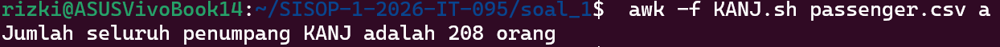

# SISOP-1-2026-IT-095

- **Nama** : Nur Rizki Syahbana  
- **NRP** : 5027251095

# Soal 1 

## Deskripsi Soal
Pada soal ini diberikan file `passenger.csv` yang berisi data penumpang Kereta Argo Ngawi Jesgejes (KANJ).  
Tugasnya adalh membuat program `awk` dalam satu file bernama `KANJ.sh` untuk menyelesaikan lima soal, yaitu:

- menghitung jumlah seluruh penumpang
- menghitung jumlah gerbong unik
- mencari penumpang tertua
- menghitung rata-rata usia penumpang
- menghitung jumlah penumpang business class
Program juga harus bisa menampilkan pesan error jika user memasukkan mode selain `a`, `b`, `c`, `d`, atau `e`.

## Penjelasan dan Cara Kerja Kode Soal 1

Membuat file `KANJ.sh` di folder `soal_1` untuk menjalankan perintah, dan memodifikasi kode di file tersebut.

### 1. Kode Header
```awk
BEGIN {
    FS = ","
    mode = ARGV[2]
    ARGV[2] = ""
```

Bagian `BEGIN` dijalankan sebelum file tersebuy dibaca.

`FS = ","` digunakan untuk memisahkan tiap kolom pada file CSV dengan koma
`mode = ARGV[2]` mengambil input soal dari argumen kedua
 `ARGV[2] = ""` digunakan agar pilihan tidak teranggap sebagai nama file oleh `awk`

---

### 2. Input
```awk
if (mode != "a" && mode != "b" && mode != "c" && mode != "d" && mode != "e") {
    print "Soal tidak dikenali. Gunakan a, b, c, d, atau e."
    print "Contoh penggunaan: awk -f KANJ.sh passenger.csv a"
    exit
}
```

Bagian ini mengecek apakah input user benar atau tidak.  
Jika user memasukkan selain `a`, `b`, `c`, `d`, atau `e`, program langsung berhenti dan menampilkan pesan error.

---

### 3. Membaca Data Tanpa header
```awk
NR > 1 {
```

`NR > 1` berfungsi sebagai hanya baris kedua dan seterusnya yang diproses.  
Hal ini dilakukan agar baris pertama yang merupakan header tidak terproses.

---

### 4. Mengambil Data Setiap Kolom
```awk
total++
nama = $1
usia = $2 + 0
kelas = $3
gerbong = $4
```

- `total++` menambah jumlah total penumpang
- `$1` kolom nama
- `$2` kolom usia
- `$3` kolom kelas
- `$4` kolom gerbong
- `+0` digunakan agar usia terbaca sebagai angka

---

### 5. Menghitung Gerbong 
```awk
unik_gerbong[gerbong] = 1
```

Array `unik_gerbong` digunakan untuk menyimpan nama atau nomor gerbong yang unik.  
Jika gerbong yang sama muncul lagi, nilainya tetap 1 sehingga tidak dihitung dua kalu.

---

### 6. Menjumlahkan Total Usia
```awk
total_usia += usia
```

Baris ini digunakan untuk menjumlahkan semua usia penumpang.  
Fungsi ini berguna untuk menghitung rata-rata usia pada mode `d`.

---

### 7. Menentukan Penumpang Tertua
```awk
if (usia > max_usia) {
    max_usia = usia
    nama_tertua = nama
}
```

Setiap usia penumpang dibandingkan dengan usia maksimum sementara.  
Jika lebih besar, maka `max_usia` dan `nama_tertua` diperbarui.

---

### 8. Menghitung Penumpang Business Class
```awk
if (kelas == "Business") {
    total_business++
}
```

Jika kolom kelas berisi `"Business"`, maka penghitung `total_business` akan bertambah 1.

---

### 9. Menampilkan Output Sesuai Mode
Fungsi `END` digunakan setelah semua data selesai diproses.

#### Mode a
```awk
print "Jumlah seluruh penumpang KANJ adalah " total " orang"
```
Menampilkan jumlah seluruh penumpang.

#### Mode b
```awk
jumlah_gerbong = 0
for (g in unik_gerbong) {
    jumlah_gerbong++
}
print "Jumlah gerbong penumpang KANJ adalah " jumlah_gerbong
```
Menghitung jumlah gerbong unik dari array.

#### Mode c
```awk
print nama_tertua " adalah penumpang kereta tertua dengan usia " max_usia " tahun"
```
Menampilkan nama penumpang tertua beserta usianya.

#### Mode d
```awk
rata = int((total_usia / total) + 0.5)
print "Rata-rata usia penumpang adalah " rata " tahun"
```
Menghitung rata-rata usia lalu membulatkannya ke bilangan bulat terdekat.

#### Mode e
```awk
print "Jumlah penumpang business class ada " total_business " orang"
```
Menampilkan jumlah penumpang yang berada di kelas Business.

Output:
#### Output subsoal a


#### Output subsoal b


#### Output subsoal c


#### Output subsoal d
<p align="center">
  
</p>

#### Output subsoal e
<p align="center">
  
</p>

#### Output input tidak valid
<p align="center">
  
</p>

---

## Kendala / Error Soal 1
Tidak ada Kendala
 
# Soal 2 - Ekspedisi Pusaka Gunung Kawi

## Deskripsi Soal
Pada soal ini, tugasnya adalah membantu Mas Amba mencari lokasi pusaka yang disembunyikan di area Gunung Kawi.  
Langkahnya adalah:

1. Menyiapkan tools
2. Mengunduh file PDF petunjuk
3. Menemukan tautan tersembunyi dari file PDF
4. Clone repository petunjuk
5. Parsing file `gsxtrack.json`
6. Menghitung titik tengah dari koordinat yang diperoleh

---

## Cara Pengerjaan Soal 2

### 1. Menyiapkan tools
Karena file awal dibagikan melalui Google Drive, dibutuhkan tools `gdown`.  
Sebelum itu perlu menyiapkan:
- Python
- pip
- virtual environment

Langkah:
```bash
python3 -m venv venv
source venv/bin/activate
pip install gdown
```

---

### 2. Mengunduh file PDF
File `peta-ekspedisi-amba.pdf` diunduh lalu diletakkan ke folder:

```bash
soal_2/ekspedisi/
```

---

### 3. Membaca isi file PDF
Setelah file berhasil didapat, isi file diperiksa melalui terminal untuk mencari petunjuk tersembunyi yang mengarah ke link lain.

---

### 4. Clone repository petunjuk
Dari tautan yang ditemukan, repository di-clone menggunakan `git`, lalu diperoleh file penting berupa:

```bash
gsxtrack.json
```

---

### 5. Parsing `gsxtrack.json`
Dari file JSON tersebut dibuat script `parserkoordinat.sh` untuk mengambil:
- `id`
- `site_name`
- `latitude`
- `longitude`

Hasil parsing disimpan ke file:
```bash
titik-penting.txt
```

---

### 6. Menghitung titik pusat pusaka
Setelah semua titik berhasil didapat, dibuat script `nemupusaka.sh` untuk menghitung titik tengah diagonal dari titik-titik tersebut.  
Hasil akhirnya disimpan ke file:
```bash
posisipusaka.txt
```

---

## Kode `parserkoordinat.sh`

```bash
#!/bin/bash

awk '
/"id":/ {
    match($0, /"id": "[^"]+"/)
    id = substr($0, RSTART+7, RLENGTH-8)
}
/"site_name":/ {
    match($0, /"site_name": "[^"]+"/)
    site = substr($0, RSTART+14, RLENGTH-15)
}
/"latitude":/ {
    match($0, /-?[0-9]+\.[0-9]+/)
    lat = substr($0, RSTART, RLENGTH)
}
/"longitude":/ {
    match($0, /-?[0-9]+\.[0-9]+/)
    lon = substr($0, RSTART, RLENGTH)
    print id ", " site ", " lat ", " lon
}
' gsxtrack.json > titik-penting.txt

echo "Parsing selesai. Hasil disimpan di titik-penting.txt"
```

---

## Penjelasan Cara Kerja `parserkoordinat.sh`

### 1. Membaca file JSON dengan `awk`
Script ini memakai `awk` untuk membaca file `gsxtrack.json` per baris.

---

### 2. Mengambil nilai `id`
```bash
/"id":/ {
    match($0, /"id": "[^"]+"/)
    id = substr($0, RSTART+7, RLENGTH-8)
}
```

- `/"id":/` mencari baris yang mengandung `id`
- `match()` mencari pola `"id": "..."` pada baris tersebut
- `substr()` mengambil nilai `id` saja tanpa tanda kutip

---

### 3. Mengambil nilai `site_name`
```bash
/"site_name":/ {
    match($0, /"site_name": "[^"]+"/)
    site = substr($0, RSTART+14, RLENGTH-15)
}
```

Bagian ini mengambil nama lokasi dari `site_name`.

---

### 4. Mengambil `latitude`
```bash
/"latitude":/ {
    match($0, /-?[0-9]+\.[0-9]+/)
    lat = substr($0, RSTART, RLENGTH)
}
```

Baris ini mencari angka latitude, baik positif maupun negatif.

---

### 5. Mengambil `longitude`
```bash
/"longitude":/ {
    match($0, /-?[0-9]+\.[0-9]+/)
    lon = substr($0, RSTART, RLENGTH)
    print id ", " site ", " lat ", " lon
}
```

Saat `longitude` ditemukan, satu data titik sudah lengkap.  
Karena itu script langsung mencetak satu baris dengan format:

```bash
id, site_name, latitude, longitude
```

Hasil akhirnya diarahkan ke file:
```bash
titik-penting.txt
```

---

## Hasil `titik-penting.txt`

```bash
node_001, Titik Berak Paman Mas Mba, -7.920000, 112.450000
node_002, Basecamp Mas Fuad, -7.920000, 112.468100
node_003, Gerbang Dimensi Keputih, -7.937960, 112.468100
node_004, Tembok Ratapan Keputih, -7.937960, 112.450000
```

---

## Kode `nemupusaka.sh`

```bash
#!/bin/bash

awk -F', ' '
NR==1 {
    lat1 = $3
    lon1 = $4
}
NR==3 {
    lat3 = $3
    lon3 = $4
}
END {
    pusat_lat = (lat1 + lat3) / 2
    pusat_lon = (lon1 + lon3) / 2
    printf "%.6f, %.6f\n", pusat_lat, pusat_lon > "posisipusaka.txt"
    printf "Koordinat pusat: %.6f, %.6f\n", pusat_lat, pusat_lon
}
' titik-penting.txt
```

---

## Penjelasan Cara Kerja `nemupusaka.sh`

### 1. Membaca file `titik-penting.txt`
Membaca hasil parsing koordinat dengan pemisah:
```bash
-F', '
```
setiap kolom dipisahkan berdasarkan koma dan spasi.

---

### 2. Mengambil dua titik diagonal
```bash
NR==1 {
    lat1 = $3
    lon1 = $4
}
NR==3 {
    lat3 = $3
    lon3 = $4
}
```

mengambil:
- baris 1 sebagai titik diagonal pertama
- baris 3 sebagai titik diagonal kedua

Karena kedua titik ini saling berseberangan, maka bisa dipakai untuk mencari titik tengah.

---

### 3. Menghitung titik tengah
```bash
pusat_lat = (lat1 + lat3) / 2
pusat_lon = (lon1 + lon3) / 2
```

Rumus yang digunakan:
- latitude pusat = `(lat1 + lat3) / 2`
- longitude pusat = `(lon1 + lon3) / 2`

---

### 4. Menyimpan hasil ke file
```bash
printf "%.6f, %.6f\n", pusat_lat, pusat_lon > "posisipusaka.txt"
```

Koordinat hasil perhitungan disimpan ke file:
```bash
posisipusaka.txt
```

---

### 5. Menampilkan hasil ke terminal
```bash
printf "Koordinat pusat: %.6f, %.6f\n", pusat_lat, pusat_lon
```

Agar hasil bisa langsung dilihat tanpa harus membuka file output.

---

## Output Soal 2

### Output parserkoordinat.sh
<p align="center">
  
</p>

---

### Output nemupusaka.sh
<p align="center">
  
</p>

---

### Isi titik-penting.txt
<p align="center">
  
</p>

---

### Isi posisipusaka.txt
<p align="center">
  
</p>

## Kendala / Error Soal 2

### 1. `gdown` belum terinstall
### 2. Salah direktori saat menjalankan script

